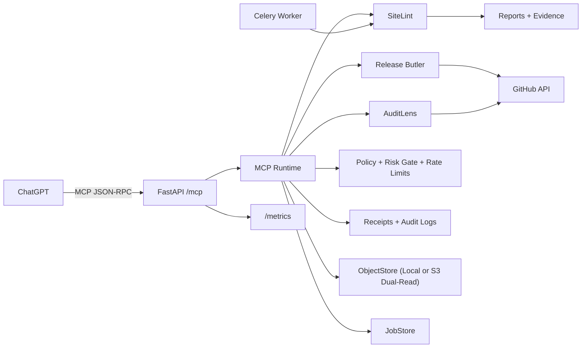

# OmniAudit MCP

Single self-hosted MCP connector that ships three production modules:

- `AuditLens` (`auditlens.*`): GitHub PR/run evidence triage and issue drafting.
- `SiteLint` (`sitelint.*`): live URL audit and report generation.
- `Release Butler` (`releasebutler.*`): release asset checksums and release-note workflows.

It exposes one MCP endpoint at `POST /mcp` and includes a lightweight dashboard at `GET /ui`.

## Features implemented

- MCP tools across all required namespaces (`auditlens`, `sitelint`, `releasebutler`, `core`).
- Backward-compatible `releasebutler.generate_notes` extensions:
  - optional `from_tag`
  - optional `to_tag`
  - optional `fallback_window`
- `releasebutler.create_release` local file asset upload (`assets[]`) with per-file outcome metadata:
  - `uploaded_assets[]`
  - `failed_assets[]`
- Object storage hardening:
  - `local` backend
  - `s3` backend with dual-read behavior (new writes to S3, legacy local refs still readable)
- Policy controls:
  - repo write allowlist
  - URL allowlist/denylist
  - write-operation confirmation token gate
  - rate limiting for scan submissions and GitHub writes
- Receipt-first write operations with immutable output references.
- Append-only audit log storage with hashed tool inputs.
- Observability baseline:
  - structured logs (`LOG_FORMAT=json|plain`)
  - optional OTLP traces (`OTEL_ENABLED=true`)
  - Prometheus `/metrics` endpoint (`PROMETHEUS_ENABLED=true`)
- GitHub auth providers:
  - fine-grained PAT
  - GitHub App installation token flow
- S3/MinIO-compatible object storage support for artifacts and reports.
- SQL storage for jobs, receipts, audit logs, and secret records.

## Repository layout

- `apps/mcp_server` - FastAPI MCP server and dashboard endpoints
- `packages/omniaudit` - domain modules, runtime, security, storage
- `services/worker` - Celery worker and async SiteLint task
- `tests` - unit + integration tests
- `infra` - Dockerfiles

## Architecture diagram



## Support matrix

| Capability | Status | Notes |
|---|---|---|
| MCP tool registry and dispatch | Ready | Backward-compatible tool names and required args maintained |
| Object storage backends | Ready | `local` and `s3` with dual-read fallback |
| Release asset uploads | Ready | Local file path assets supported |
| Live smoke automation | Ready | `scripts/smoke_hardening_pass2.sh` |
| SiteLint wave 1 optional args | Ready | `crawl_budget`, `entry_paths`, `auth_profile_id`, `baseline_scan_id` |
| AuditLens wave 1 optional args | Ready | `parser_profile`, `dedupe_strategy`, issue drafting extensions |
| Release Butler wave 1 optional args | Ready | `group_by`, `include_pr_links`, `draft`, `prerelease`, `dry_run` |
| Governance baseline | Ready | CI workflows, templates, CODEOWNERS, policy docs |

## Quickstart (local)

1. Create env and install dependencies:

```bash
uv venv .venv
uv pip install --python .venv/bin/python -e '.[test]'
```

2. Configure environment:

```bash
cp .env.example .env
```

3. Bootstrap local data folders and key:

```bash
./scripts/bootstrap.sh
```

4. Run API:

```bash
PYTHONPATH=packages:apps:services .venv/bin/uvicorn mcp_server.main:app --host 0.0.0.0 --port 8080
```

Optional SiteLint browser stack:

```bash
./scripts/install_sitelint_toolchain.sh
```

5. Health check:

```bash
curl -s http://localhost:8080/healthz
```

## Quickstart (Docker Compose)

```bash
cp .env.example .env
./scripts/bootstrap.sh
docker compose up --build
```

API endpoint: `http://localhost:8080/mcp`
Metrics endpoint: `http://localhost:8080/metrics`

## ChatGPT Connector setup

In ChatGPT Developer Mode connector modal:

- Name: `OmniAudit MCP`
- MCP Server URL: `https://<your-host>/mcp`
- Authentication:
  - set to `None` if `MCP_AUTH_MODE=none`
  - set to API key flow if you enable `MCP_AUTH_MODE=api_key`

## Storage backend modes

Default mode is local:

```env
OBJECT_STORE_BACKEND=local
```

S3/MinIO mode with dual-read, S3-write:

```env
OBJECT_STORE_BACKEND=s3
OBJECT_STORE_BUCKET=omniaudit
OBJECT_STORE_PREFIX=omniaudit
S3_ENDPOINT_URL=http://minio:9000
S3_FORCE_PATH_STYLE=true
S3_ACCESS_KEY_ID=minioadmin
S3_SECRET_ACCESS_KEY=minioadmin
```

Behavior in `s3` mode:
- new immutable objects are written to `s3://<bucket>/<prefix>/<sha256>...`
- existing local file refs continue to resolve via fallback reads
- no migration is required for existing receipt `result_ref` values

## MCP examples

List tools:

```bash
curl -s http://localhost:8080/mcp -H 'Content-Type: application/json' -d '{
  "jsonrpc":"2.0",
  "id":1,
  "method":"tools/list",
  "params":{}
}'
```

Start site scan:

```bash
curl -s http://localhost:8080/mcp -H 'Content-Type: application/json' -d '{
  "jsonrpc":"2.0",
  "id":2,
  "method":"tools/call",
  "params":{
    "name":"sitelint.start_scan",
    "arguments":{
      "url":"https://example.com",
      "profile":"standard",
      "viewport_set":"desktop_mobile"
    }
  }
}'
```

Write operation risk gate flow (`auditlens.create_issue`):

1. Call without `confirmation_token` and read `structuredContent.confirmation_token`.
2. Repeat call with that token to execute write and receive `receipt_id`.

Generate tag-to-tag notes:

```bash
curl -s http://localhost:8080/mcp -H 'Content-Type: application/json' -d '{
  "jsonrpc":"2.0",
  "id":3,
  "method":"tools/call",
  "params":{
    "name":"releasebutler.generate_notes",
    "arguments":{
      "repo":"Prekzursil/AdrianaArt",
      "from_tag":"v1.0.0",
      "to_tag":"v2.0.0",
      "fallback_window":25
    }
  }
}'
```

Create release with local assets (confirmation flow):

1. First call `releasebutler.create_release` without `confirmation_token`.
2. Re-call with returned `confirmation_token` and local file paths in `assets[]`.
3. Inspect `uploaded_assets` and `failed_assets` in `structuredContent`.

## Live smoke workflow

Run production-style dual-read/S3-write smoke checks locally:

```bash
./scripts/smoke_hardening_pass2.sh
```

Outputs:
- `artifacts/smoke/<timestamp>/summary.json`
- `artifacts/smoke/<timestamp>/responses/*.json`

Key assertions:
- legacy local refs remain readable after switching to S3 backend
- new writes become `s3://...`
- release upload confirmation flow succeeds with local assets
- metrics endpoint exposes hardening counters

## Observability

Structured logging:

```env
LOG_FORMAT=json
```

Optional OTLP tracing:

```env
OTEL_ENABLED=true
OTEL_EXPORTER_OTLP_ENDPOINT=http://otel-collector:4318/v1/traces
```

Prometheus metrics:

```env
PROMETHEUS_ENABLED=true
```

Exposed series include:
- `omniaudit_tool_calls_total{tool,status}`
- `omniaudit_tool_latency_seconds{tool}`
- `omniaudit_write_gate_denied_total{tool}`
- `omniaudit_rate_limit_denied_total{bucket}`

## Tests

```bash
TMPDIR=/tmp TEMP=/tmp TMP=/tmp .venv/bin/pytest -q -s
```

## Notes

- `sitelint.start_scan` runs inline by default for deterministic single-user behavior.
- Set `SITELINT_ASYNC_MODE=true` and run `worker` service to process scan jobs via Celery.
- GitHub API operations require valid credentials in `.env`.
- In Docker + MinIO setups, keep `S3_FORCE_PATH_STYLE=true` for compatibility.
- For roadmap and release-note policy, see `docs/ROADMAP.md` and `docs/CHANGELOG_POLICY.md`.

See `docs/ARCHITECTURE.md` and `docs/OPERATIONS.md` for details.
